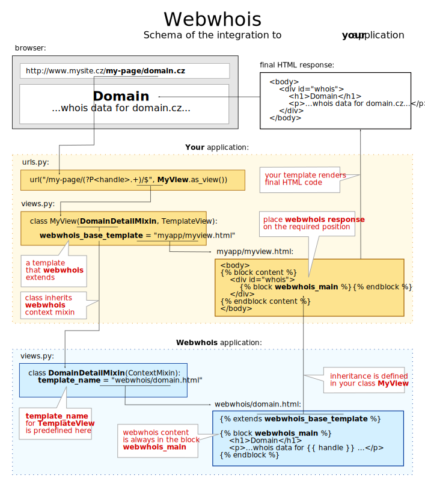

========
Webwhois
========

The **Webwhois** is a Django-based application of the Whois service.
It is used for browsing objects in the **FRED** registry system.
The application searches domain names, contacts, nameserver sets and key sets.

Dependencies
============

- python (2.7)
- python-django (1.7)
- python-omniorb
- python-lxml
- python-freddist (archive.nic.cz) - used only for installation
- python-pyfco (archive.nic.cz)

A part of the FRED system
=========================

The ``webwhois`` is a part of the FRED_ system for managing domain names.
The easiest way to use it, is to install it with the **fred-manager** script.
The manager installs the whole *FRED server* including all accessories.

If you want to run ``webwhois`` instantly without installation, you only need to set
the host name and port of the running CORBA name service (``WEBWHOIS_CORBA_NETLOC``).

.. Note::
    To set the host, you can also use the environment variable ``FRED_WEBWHOIS_NETLOC``.

Run the server without installation
===================================

You can launch ``webwhois`` without installation, after you have sorted out all dependencies
and started the *FRED* server. Tests requires the package ``mock``.

Run tests:

.. code:: shell

	PYTHONPATH=.:webwhois_site webwhois_site/webwhois_site/manage.py test

.. Note::

   You must have already set the name service host.

Run site server directly from the project folder:

.. code:: shell

   PYTHONPATH=.:webwhois_site FRED_WEBWHOIS_NETLOC=my.fred.com:44846 webwhois_site/webwhois_site/manage.py runserver

Installation
============

If you do not use the *fred-manager* script for installation, you can install the project separately as you like.
There are two parts of the project: The ``webwhois`` application itself and the project ``webwhois_standalone``
as an example of a web site, which integrates the ``webwhois`` application.

Instructions for custom installation:

1. Choose a folder for your installation:

   .. code:: shell

       DEST=/tmp/mywebwhois

2. Install the "webwhois" application:

   .. code:: shell

       python ~/cznic/fred/webwhois/setup.py install --root=$DEST

3. Install the standalone project:

   .. code:: shell

       python ~/cznic/fred/webwhois/webwhois_site/setup.py install --root=$DEST

4. Modify the path to static files in *settings.py* to ensure a correct display of images and CSS in runserver and ``DEBUG`` mode.

   .. code:: shell

       SITE_ROOT=`dirname $(find $DEST -name manage.py)`
       STATIC_ROOT=$(find $DEST -name static)
       sed -i "s|^STATIC_URL|STATICFILES_DIRS=['$STATIC_ROOT']\nSTATIC_URL|1" $SITE_ROOT/settings.py

5. Launch website with the **runserver** command in ``DEBUG`` mode (with the nameservice host).

   .. code:: shell

       PYTHONPATH=$SITE_ROOT/.. FRED_WEBWHOIS_NETLOC=my.fred.com:44846 python $SITE_ROOT/manage.py runserver

Configuration
=============

The following variables should be added to the project's ``settings.py``.
Check an example in webwhois/webwhois_site/webwhois_site/settings.py.
Only ``'webwhois'`` in ``INSTALLED_APPS`` is obligatory.

Integration
-----------

``INSTALLED_APPS``
^^^^^^^^^^^^^^^^^^

Make sure that the ``webwhois`` is listed in your ``INSTALLED_APPS`` variable::

    INSTALLED_APPS = (
        ...
        'webwhois',
        ....
    )

CORBA settings
--------------

CORBA variables are required to establish a connection to the **FRED server** instance.

``WEBWHOIS_CORBA_NETLOC``
^^^^^^^^^^^^^^^^^^^^^^^^^

Network location, i.e. host and port, of the CORBA server.
Used to construct Interoperable Object Reference (IOR).
Default value is either ``FRED_WEBWHOIS_NETLOC`` environment variable or ``localhost``.

Example::

    WEBWHOIS_CORBA_NETLOC= 'localhost:12345'

``WEBWHOIS_CORBA_CONTEXT``
^^^^^^^^^^^^^^^^^^^^^^^^^^

The ``WEBWHOIS_CORBA_CONTEXT`` variable contains a name of the CORBA context.

Example::

    WEBWHOIS_CORBA_CONTEXT = 'fred'

Default value::

    'fred'

``WEBWHOIS_LOGGER``
^^^^^^^^^^^^^^^^^^^

The ``WEBWHOIS_LOGGER`` variable contains definition for import logger object. It can be ``None``.

Example::

    WEBWHOIS_LOGGER = 'pylogger.corbalogger.LoggerFailSilent'

Default value::

    'pylogger.corbalogger.Logger'

``WEBWHOIS_LOGGER_CORBA_NETLOC``
^^^^^^^^^^^^^^^^^^^^^^^^^^^^^^^^

Network location, i.e. host and port, of the CORBA server for logging.
Used to construct Interoperable Object Reference (IOR).
By default a ``WEBWHOIS_CORBA_NETLOC`` is used.

``WEBWHOIS_LOGGER_CORBA_CONTEXT``
^^^^^^^^^^^^^^^^^^^^^^^^^^^^^^^^^

The ``WEBWHOIS_LOGGER_CORBA_CONTEXT`` variable contains a name of the Logger CORBA context. This is usually same as
a **Fred CORBA** instance.

Example::

    WEBWHOIS_LOGGER_CORBA_CONTEXT = WEBWHOIS_CORBA_CONTEXT

Default value::

    WEBWHOIS_CORBA_CONTEXT

Search engines settings
-----------------------

Information about search engines. It is a list of engines for searching domain
names in zones that are not managed by *FRED*. They are displayed
on the "Search in Registry" form page.

``WEBWHOIS_SEARCH_ENGINES``
^^^^^^^^^^^^^^^^^^^^^^^^^^^

The ``WEBWHOIS_SEARCH_ENGINES`` variable contains a list of dictionaries with values
required for displaying links. Each dictionary contains keys: ``label`` for link label
and ``href`` for link attribute *href*.

Example::

    WEBWHOIS_SEARCH_ENGINES = (
        {"label": "WHOIS.COM Lookup", "href": "http://www.whois.com/whois/"},
        {"label": "IANA WHOIS Service", "href": "http://www.iana.org/whois"},
    )

Default value::

    (
        {"label": "WHOIS.COM Lookup", "href": "http://www.whois.com/whois/"},
        {"label": "IANA WHOIS Service", "href": "http://www.iana.org/whois"},
    )

Registrars settings
-------------------

Information about registrars. There are links displayed on the page with a list of registrars.

``WEBWHOIS_HOW_TO_BECOME_A_REGISTRAR_URL``
^^^^^^^^^^^^^^^^^^^^^^^^^^^^^^^^^^^^^^^^^^

The ``WEBWHOIS_HOW_TO_BECOME_A_REGISTRAR_URL`` variable contains a link to the description
"How to become a registrar".

Example::

    WEBWHOIS_HOW_TO_BECOME_A_REGISTRAR_URL = "https://www.nic.cz/page/309/how-to-become-a-registrar-/"

Default value::

    None

``WEBWHOIS_REGISTRAR_CERTIFIED_FOR_RETAIL_URL``
^^^^^^^^^^^^^^^^^^^^^^^^^^^^^^^^^^^^^^^^^^^^^^^

The ``WEBWHOIS_REGISTRAR_CERTIFIED_FOR_RETAIL_URL`` variable contains a link to the page with the list of registrars.

Example::

    WEBWHOIS_REGISTRAR_CERTIFIED_FOR_RETAIL_URL = "https://www.nic.cz/page/928/"

Default value::

    None

``WEBWHOIS_REGISTRAR_SUPPORTS_DNSSEC``
^^^^^^^^^^^^^^^^^^^^^^^^^^^^^^^^^^^^^^

The ``WEBWHOIS_REGISTRAR_SUPPORTS_DNSSEC`` variable contains a link to the page with the specific content related to
the subject.

Example::

    WEBWHOIS_REGISTRAR_SUPPORTS_DNSSEC = "https://www.nic.cz/page/928/#dnssec"

Default value::

    None

``WEBWHOIS_REGISTRAR_SUPPORTS_MOJEID``
^^^^^^^^^^^^^^^^^^^^^^^^^^^^^^^^^^^^^^

The ``WEBWHOIS_REGISTRAR_SUPPORTS_MOJEID`` variable contains a link to the page with the specific content related to
the subject.

Example::

    WEBWHOIS_REGISTRAR_SUPPORTS_MOJEID = "https://www.nic.cz/page/928/#mojeid"

Default value::

    None

``WEBWHOIS_REGISTRAR_SUPPORTS_IPV6``
^^^^^^^^^^^^^^^^^^^^^^^^^^^^^^^^^^^^

The ``WEBWHOIS_REGISTRAR_SUPPORTS_IPV6`` variable contains a link to the page with the specific content related to
the subject.

Example::

    WEBWHOIS_REGISTRAR_SUPPORTS_IPV6 = "https://www.nic.cz/page/928/#ipv6"

Default value::

    None

``WEBWHOIS_REGISTRARS_GROUPS_CERTIFIED``
^^^^^^^^^^^^^^^^^^^^^^^^^^^^^^^^^^^^^^^^

The ``WEBWHOIS_REGISTRARS_GROUPS_CERTIFIED`` variable contains a code that represents certified registrars in the registry.
The certified registrars are shown in the list "Registrars offering also retail services".

Example::

    WEBWHOIS_REGISTRARS_GROUPS_CERTIFIED = ["certified"]

Default value::

    []

``WEBWHOIS_REGISTRARS_GROUPS_UNCERTIFIED``
^^^^^^^^^^^^^^^^^^^^^^^^^^^^^^^^^^^^^^^^^^

The ``WEBWHOIS_REGISTRARS_GROUPS_UNCERTIFIED`` variable contains a code that represents uncertified registrars in the registry.
The uncertified registrars are shown in the list "Registrars offering only wholesale services".

Example::

    WEBWHOIS_REGISTRARS_GROUPS_UNCERTIFIED = ["uncertified"]

Default value::

    []

DNSSEC settings
---------------

Information about the DNSSEC system. There is a link displayed on the page above the list of registrars.

``WEBWHOIS_DNSSEC_URL``
^^^^^^^^^^^^^^^^^^^^^^^

The ``WEBWHOIS_DNSSEC_URL`` variable containts a link to the page describing the system. It can be ``None``.

Example::

    WEBWHOIS_DNSSEC_URL = "http://www.nic.cz/dnssec/"

Default value::

    None

Dobradomena settings
--------------------

Information about the site *Dobradomena*. There is a link displayed on the page above the list of registrars.

``WEBWHOIS_DOBRADOMENA_ROOT``
^^^^^^^^^^^^^^^^^^^^^^^^^^^^^

The ``WEBWHOIS_DOBRADOMENA_ROOT`` variable contains a path to the folder with the PDF-manual files that the site serves.

Example::

    WEBWHOIS_DOBRADOMENA_ROOT = '/tmp/dobradomena/'

.. note::
    Files are stored in the path with the pattern
    ``WEBWHOIS_DOBRADOMENA_ROOT`` / registrar-name / language-code / ``WEBWHOIS_DOBRADOMENA_FILE_NAME``.
    For example ``/tmp/dobradomena/fred_a/en/manual.pdf``.

Default value::

    None

``WEBWHOIS_DOBRADOMENA_FILE_NAME``
^^^^^^^^^^^^^^^^^^^^^^^^^^^^^^^^^^

The ``WEBWHOIS_DOBRADOMENA_FILE_NAME`` variable contains a PDF-manual file name.

Example::

    WEBWHOIS_DOBRADOMENA_FILE_NAME = "manual.pdf"

Default value::

    None

``WEBWHOIS_DOBRADOMENA_MANUAL_URL_PATTERN``
^^^^^^^^^^^^^^^^^^^^^^^^^^^^^^^^^^^^^^^^^^^

The ``WEBWHOIS_DOBRADOMENA_MANUAL_URL_PATTERN`` variable contains the pattern for the file name mapping.

Example::

    WEBWHOIS_DOBRADOMENA_MANUAL_URL_PATTERN = '/dobradomena/%(handle)s/%(lang)s/'

.. note::
    Example of using a 3rd-level domain: ``http://%(handle)s.dobradomena.cz/dobradomena/``.

Default value::

    None

``WEBWHOIS_HOW_TO_REGISTER_LINK``
^^^^^^^^^^^^^^^^^^^^^^^^^^^^^^^^^

The ``WEBWHOIS_HOW_TO_REGISTER_LINK`` variable contains a dictionary with items for URL.
The dictionary contains keys ``label`` for link label and ``href`` for link attribute *href*.
The link is displayed on the page as a clue in case the object was not found in the registry.

Example::

    WEBWHOIS_HOW_TO_REGISTER_LINK = {
        "href": "http://www.dobradomena.cz/",
        "label": "www.dobradomena.cz"
    }

Default value::

    None

MojeID settings
---------------

Optional variables for links to MojeID service. This is an extra content that extends the basic webwhois application.

``WEBWHOIS_MOJEID_REGISTRY_ENDPOINT``
^^^^^^^^^^^^^^^^^^^^^^^^^^^^^^^^^^^^^

The ``WEBWHOIS_MOJEID_REGISTRY_ENDPOINT`` variable contains a path to the MojeID registration form endpoint.
It can be ``None``.

Example::

    WEBWHOIS_MOJEID_REGISTRY_ENDPOINT = "%s/mogrify/preface/" % WEBWHOIS_MOJEID_HOST

Default value::

    None

``WEBWHOIS_MOJEID_TRANSFER_ENDPOINT``
^^^^^^^^^^^^^^^^^^^^^^^^^^^^^^^^^^^^^

The ``WEBWHOIS_MOJEID_TRANSFER_ENDPOINT`` variable contains a path to the MojeID form for contact transfer
from the registry. It can be ``None``.

Example::

    WEBWHOIS_MOJEID_TRANSFER_ENDPOINT = "%s/transfer/endpoint/" % WEBWHOIS_MOJEID_HOST

Default value::

    None

``WEBWHOIS_MOJEID_LINK_WHY``
^^^^^^^^^^^^^^^^^^^^^^^^^^^^

The ``WEBWHOIS_MOJEID_LINK_WHY`` variable contains a path to the page about service benefits on the MojeID site.
It can be ``None``.

Example::

    WEBWHOIS_MOJEID_LINK_WHY = "%s/vyhody/" % WEBWHOIS_MOJEID_HOST

Default value::

    None

The schema of integration into a project
========================================

The schema is shown on the main page of the standalone site.

.. _FRED: https://fred.nic.cz/
